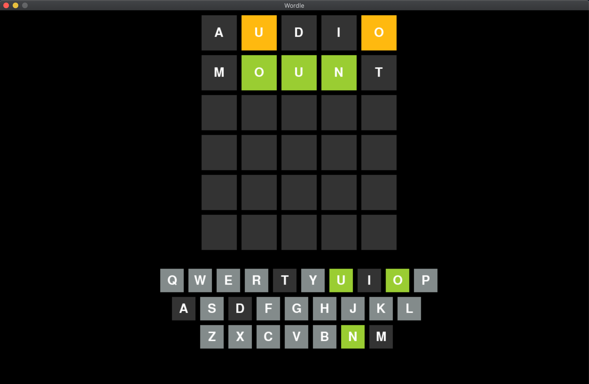

# Infinite_Wordle
This project aims to liberate the popular Wordle game, and allows people to play it in a familiar UI on their computers. Back by a SQLite database with over 2300 words to guess from and nearly 5800 valid guesses, this program should keep you thinking for quite a while. 

### Making a Guess

Guesssing a word reveals new information that leads you to the correct word. When the grid updates, an orange square indicates the letter is in the word, but not in the correct position. Green indicates perfect placement! If the box remains dark, the letter isn't in the word at all. The keyboard below lets you keep track of all letters as you progress through your 6 chances at guessing correctly. Since this software is meant for personal computers, the keyboard is purely for displaying information.

### Playing again is as simple as pressing a button

After the game is won or lost, the correct word is always revealed on the left of the screen. A "Play Again" button appears on the right, and once pressed the game starts again with a brand new word.
